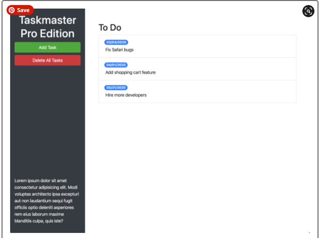

# taskmaster-pro
Module 5 work: Third-party APIs (Bootstrap &amp; jQuery)

## Purpose
A company called Taskmaster has recruited me to expand their task-management application. To do this, I'll need to work with their existing codebase, which was built using jQuery, a third-party JavaScript library that simplifies DOM manipulation, and the front-end CSS library Bootstrap.

## Built With
* Bootstrap
* jQuery
* jQuery UI
* jQuery Touch Punch
* Moment.js
* Google Fonts
* Open Iconic
* Git Hub

## Contribution
Made with ❤️ by Samantha Malone
Shout out to my tutor
© 2021 Samantha Malone. All rights reserved.
